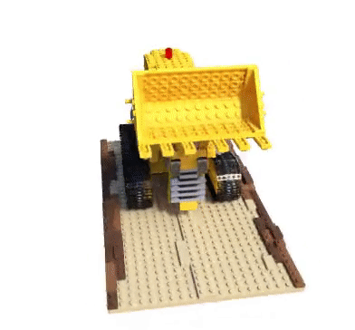

# NeRF_this

This is ML course 2023 final project : "Novel view synthesis with neural radiance fields" or simply NeRF

## :computer: Installation

All the tests were performed using Google Colab GPU's Tesla P100.

        git clone https://github.com/melhaud/proj18.git

The requred packages can be installed from ``requirements.txt``:

        pip install -r requirements.txt

Or by creating custom environment nerf-this by simply running:

        conda create env
        
You can download Instant NGP [here](https://github.com/NVlabs/instant-ngp/blob/master/docs/nerf_dataset_tips.md)

## This repository is...

We used the provided GitHub (https://github.com/colmap/colmap) repository to access the NeRF algorithm's implementation. 
We executed the code on two datasets: the synthetic 360 Lego dataset and the real forward facing LLFF Fern dataset. Both provided by folowing [link](https://drive.google.com/drive/folders/128yBriW1IG_3NJ5Rp7APSTZsJqdJdfc1). We replicated [Berkeley’s paper](https://arxiv.org/pdf/2003.08934.pdf) results. 

In this project we implement COLMAP [link to github](https://github.com/colmap/colmap) and nerf-pytorch [link to github](https://github.com/yenchenlin/nerf-pytorch)

First of all we derivee and explained the formula for casting rays (provided in the report). Then trained NeRF model  on downloaded synthetic Lego dataset and real LLFF Fern dataset. As the result obtained mean PSNR and SSIM metrics on train and test images, mean reconstruction time per 1 image and training curves. 

GIF for fern dataset generated by NeRf |  GIF for lego dataset generated by NeRf_this 
:-------------------------:|:-------------------------:
 |  

 

 

## Conclusions: 

Nerf has a mean reconstruction time of more than 8 hours per objects (11+ in the training phase). Several artifacts appears. In conclusion, while the NeRF algorithm produces high-quality images with realistic lighting and textures, its performance heavily relies on the accuracy of camera poses and intrinsic parameters, and it has limitations in handling large-scale scenes and requiring substantial training data. Providing additional data through the use of COLMAP can improve the accuracy of pose estimation, which is crucial for NeRF. Meanwhile, Instant-NGP offers a faster alternative with a small loss of quality.

## Team

+ Anton Labutin
+ Marco Offidani
+ Maryush Soroka
+ Vladislav Mityukov
+ Yunseok Park
